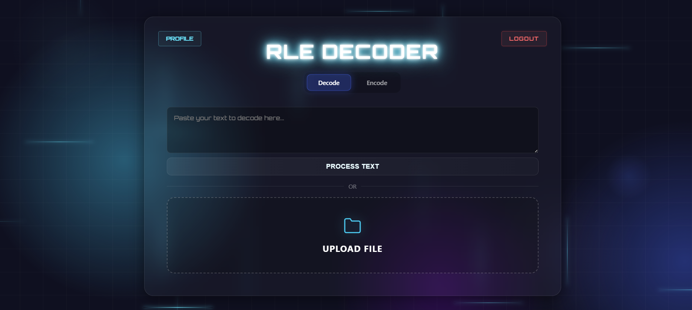

# 🌌 CodeRun 2025 - RLE Encoder/Decoder

A Full-Stack Web Application for **Run-Length Encoding (RLE)** compression, featuring a high-performance React frontend and a secure Django backend.



## 🚀 About the Project
This application allows users to compress and decompress text files using the RLE algorithm. It goes beyond a simple script by implementing a full user authentication system, history tracking database, and a responsive "Glassmorphism" UI with GPU-accelerated particle animations.

## 🛠️ Tech Stack

**Frontend:**
* **React.js:** Component-based UI architecture.
* **CSS3:** Custom Glassmorphism, 3D Grid Animations, Floating Particles.
* **Fetch API:** Secure communication with the Django REST endpoints.

**Backend:**
* **Django (Python):** Robust MVC framework handling routing and logic.
* **SQLite:** Relational database for User Accounts and Conversion History.
* **Django Auth:** Secure Login, Registration, and Session management.

## ✨ Key Features
* **🔐 Authentication:** Secure Login/Register system with password hashing.
* **📜 History Tracking:** Automatically saves every encode/decode operation to the database.
* **⚡ CRUD Functionality:** Users can view and delete their specific history items.
* **🎨 Cyberpunk UI:** A fully themed interface with neon glows, animated backgrounds, and interactive hover states.
* **📱 Responsive:** Works on Desktop and Mobile devices.

## ⚙️ Local Setup Guide

If you want to run this locally, follow these steps:

### 1. Clone the Repository
```bash
git clone https://github.com/owaseraph/RLE_Fullstack_Tool.git
cd coderun-2025
```
### 2. Backend Setup
```bash
# Create a virtual environment
python -m venv venv
# Activate it (Windows: venv\Scripts\activate || Mac: source venv/bin/activate)

# Install dependencies
pip install django

# Run Migrations
python manage.py migrate

# Start Server
python manage.py runserver
```

### 3. Frontend Setup
```bash
cd frontend
npm install
npm run build
```
* Then visit `http://127.0.0.1:8000` in your browser.

